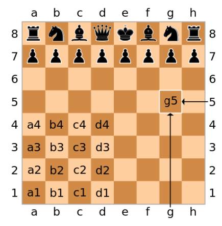

# App scacchi

* Applicazione per il gioco *2-players* degli scacchi

  * I due giocatori si alternano su un unico device Command Line Interface (**CLI**) 

* Le mosse sono descritte in [notazione algebrica](https://it.wikipedia.org/wiki/Notazione_algebrica)
   - 1. e4 e5
   - 2. Cf3 Cc6
   - 3. d4 

